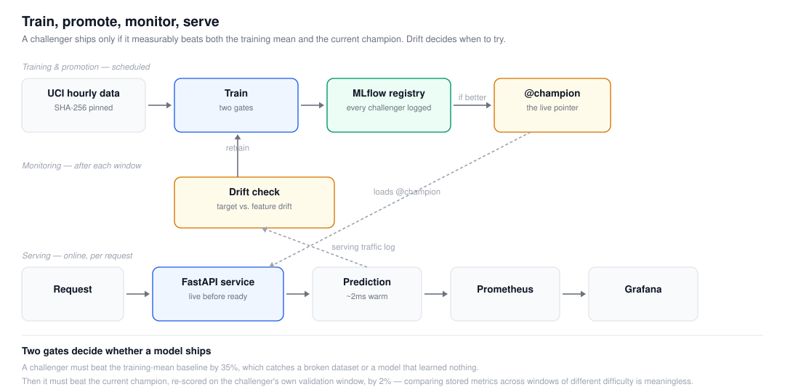

# drift-aware-ml-platform

[](https://github.com/mzquadri/drift-aware-ml-platform/actions/workflows/ci.yml)

An hourly demand-forecasting service that notices when its own model has gone
stale, and retrains itself when it has.

Most portfolio MLOps projects train a model, wrap it in FastAPI and stop. The
interesting problems start after that: how do you know the model is still any
good, what stops a worse model from shipping, and what happens when the world
moves. This is built around those three questions, and two of the answers turned
out to be counterintuitive enough that getting them wrong would have made the
whole thing quietly useless.

## The loop, measured

Every number below came from running it, not from a design document.

| Step | What happened |
|---|---|
| 1. Train on 2011 | MAE **51.49**, R² **0.621** on 1,729 held-out hours, against a mean baseline of 98.94. Promoted, registry version 1. |
| 2. Train again, unchanged | *Refused.* "challenger MAE 51.49 is not 2% better than champion 51.49" |
| 3. Monitor 2012 against 2011 | *Retrain.* Target drifted **0.679**, while only **9%** of features moved |
| 4. Retrain including 2012 | Champion re-scored on the new window: MAE **116.57**. Challenger: **95.48**, 18% better. Promoted, version 4. |
| 5. Service reloads | `/ready` reports `model_version: 4`, `/predict` answers in ~2 ms warm |

<picture>
  <source media="(prefers-color-scheme: dark)" srcset="docs/architecture-dark.svg">
  <source media="(prefers-color-scheme: light)" srcset="docs/architecture.svg">
  
</picture>

## Two things that were wrong, and how they showed up

**The drift signal was not where I expected it.** The obvious design watches the
input features. On this data that design is nearly silent: between 2011 and 2012
only humidity crosses the threshold, a feature drift share of 0.09. Meanwhile
mean hourly ridership goes from 144 to 235 and the target's drift score is 0.679.
The covariates barely move; the relationship between them and the target does.
A feature-only monitor sleeps through a 63% rise in demand. So
[`decide_retrain`](src/mlplatform/drift.py) fires on either signal, and checks
the target first because that is the one that actually trips here.

Worth naming the three things precisely, because the literature separates them
and this project only measures two ([Gama et al. 2014](https://dl.acm.org/doi/10.1145/2523813);
[Lu et al. 2019](https://arxiv.org/abs/2004.05785)):

| | what moves | measured here |
|---|---|---|
| Covariate shift | P(X) | feature drift share, **0.09** |
| Label shift | P(y) | target drift, **0.679** |
| Real concept drift | P(y\|X) | not monitored directly |

The 0.679 is **label shift**: a distance between two marginal distributions of
`cnt`. It is a proxy, and on this data a good one. The evidence that the
*relationship* moved is elsewhere in this table and it is stronger — the 2011
champion re-scored on 2012 gets MAE 116.57 where a model trained on the new
window gets 95.48. An old mapping fitting worse than a new one is what P(y|X)
moving looks like.

**Comparing MAE across different validation windows is meaningless.** The first
version of the gate compared the challenger's MAE against the champion's stored
MAE. Those are measured on different data: the champion was scored on 2011
(mean demand 144), the challenger on 2012 (mean 235). MAE scales with the
magnitude of the target, so the retrained model looked *worse*, 95.48 against
51.49, and the gate blocked the very promotion that drift had just called for.
R² told the truth the whole time, 0.622 against 0.621, the same model quality on
a harder window. The fix is in
[`_champion_mae_on`](src/mlplatform/train.py): load the live champion and score
it on the challenger's own validation slice. On the same window the champion
gets 116.57 and the challenger's 95.48 is the 18% improvement it always was.

## The decisions that make it a platform

**A model only ships if it is measurably better.** Two gates. A challenger must
beat "predict the training mean" by 35%, which catches a broken dataset or a
model that failed to learn. Then it must beat the current champion, re-scored on
the same window, by 2%, which stops a noise-better model churning production
every night. Both thresholds live in config, and the reason a model was refused
is written to the run summary, so a failed promotion is auditable rather than
mysterious.

**Measurement and policy are separate.** Evidently produces the statistics;
`decide_retrain` applies the policy. That split means the policy has unit tests
that need no library, no network and no data, and the awkward ordering lives
somewhere you can see it: the window-size guard runs *before* the drift check,
because a handful of rows fails a distribution test for reasons that have
nothing to do with the world moving.

**Liveness and readiness answer different questions.** `/health` is true whenever
the process can answer and deliberately does not depend on the model. An earlier
version loaded the champion inline during startup, which meant an unreachable
registry held startup open for minutes with the service neither live nor able to
say why. It now loads in a background thread: live immediately, not ready until
the model arrives, which is exactly the distinction the two probes exist for.

## Would a streaming detector have been faster

The monitor here compares distributions over a window. The concept-drift
literature does something else: it watches the model's own error one observation
at a time, with detectors like ADWIN, Page-Hinkley and KSWIN. That family looks
at the thing the window monitor only proxies, so the obvious question is whether
it would have spoken sooner.

It would not, and two of the three cannot tell drift from no drift at all.
`python scripts/experiments/drift_latency.py` streams the 2011 champion over
held-out 2011 — the regime it was trained on, where any alarm is a false one —
and over 2012, and writes [`results/drift_latency.json`](results/drift_latency.json):

| detector | control (2011) | 2012 |
|---|---|---|
| Page-Hinkley | 57 alarms, first at row 29 | 291 alarms, first at row **29** |
| ADWIN | 2 alarms, first at row 383 | 8 alarms, first at row 159 |
| KSWIN | 5 alarms, first at row 195 | 27 alarms, first at row **303** |

Page-Hinkley fires at the same row whether the world moved or not. KSWIN fires
*later* under drift than without it. Only ADWIN is directionally sensible, and
at default settings it still raises false alarms.

Calibrated on the control alone — the most sensitive setting that stays silent
on 2011, never chosen by what it does to 2012 — ADWIN at `delta=1e-5` gives zero
false alarms and first speaks at row 1855, about 77 days in. The target signal
already here crosses its threshold between rows 1855 and 2500. **The streaming
detector arrives at the same time as the monitor that was already running**, and
costs a dependency plus a parameter that has to be recalibrated per deployment.
Measured, written down, not adopted.

### What the same run found about the monitor that is here

`decide_retrain` returns `True` from 500 rows of 2012, which is not the behaviour
the table above describes. The first 500 rows are **January only**, against a
reference spanning twelve months, so `temp`, `atemp`, `season`, `mnth`,
`holiday` and `windspeed` all cross their thresholds for calendar reasons.

| rows | days | months present | feature share | target |
|---|---|---|---|---|
| 500 | 21 | 1 | 0.64 | 0.169 |
| 1500 | 62 | 1–3 | 0.55 | 0.044 |
| 4000 | 167 | 1–6 | 0.55 | 0.494 |
| 8734 | 364 | 1–12 | **0.09** | 0.679 |

The 0.09 that the section above calls nearly silent is a full-year number. At
every partial window the feature share is 55–73%, and it falls only when the
serving window finally covers the same seasons as the reference.

`min_window_rows` is 500, which is 21 days. The guard is right in principle — it
exists precisely so a short window cannot fail a distribution test for reasons
that have nothing to do with the world moving — and it counts the wrong thing. No
number of rows inside a single season makes that comparison mean what it is being
read to mean. Changing it changes when retraining fires, so it is recorded here
rather than quietly adjusted.

## Why this dataset

[UCI Bike Sharing](https://archive.ics.uci.edu/dataset/275/bike+sharing+dataset),
hourly counts for 2011 and 2012, downloaded at runtime and pinned by SHA-256 on
first fetch so a silently republished file fails the run instead of changing the
model underneath you.

`casual` and `registered` sum to `cnt` exactly, so both are dropped in
[`data.py`](src/mlplatform/data.py) before anything else sees the frame. A model
handed either one validates almost perfectly and is worthless in production.
Dropping them once, at the edge, is why no later stage has to remember to.

The validation split is the chronological tail, not a random sample. Demand is a
time series; a random split lets the model validate against hours whose
neighbours it trained on.

## Running it

Local, no cloud account:

```bash
pip install -e ".[dev]"
export MLFLOW_TRACKING_URI=sqlite:///mlflow.db   # registry without a server

mlplatform fetch                    # download and pin the dataset
mlplatform train                    # fit a challenger, apply both gates
mlplatform monitor                  # compare 2012 against 2011, decide
mlplatform train --include-current  # retrain on the drifted window
mlplatform serve                    # http://localhost:8000/docs
```

Full stack with MLflow, Airflow, Prometheus and Grafana:

```bash
docker compose up --build
```

| Service | URL |
|---|---|
| Prediction API | http://localhost:8000/docs |
| MLflow | http://localhost:5000 |
| Airflow | http://localhost:8080 |
| Prometheus | http://localhost:9090 |
| Grafana | http://localhost:3000 |

The architecture diagram above is generated, not drawn by hand:

```bash
python scripts/figures/generate_diagram.py   # docs/architecture.svg
```

## Notes on the stack

**MLflow 3 aliases, not stages.** Stages are deprecated. An alias is a pointer
you move, with no state machine behind it to fall out of step with what is
actually serving. `models:/bike-demand@champion` is what the service loads.

**skops, with one type explicitly trusted.** MLflow 3 serialises sklearn models
with skops, which refuses to write a type it cannot vouch for, and a forest's
node array is one of those: skops can load it, but the raw child indices are
read without bounds checking, so a tampered file can crash the process on
predict. Naming the single reviewed type keeps that protection for everything
else. Falling back to cloudpickle would have sidestepped the check entirely and
been the worse answer.

**Evidently 0.7 reports distances, not p-values.** Wasserstein for numeric
columns, Jensen-Shannon for categorical. Thresholds in config are distances, so
higher means more drift. The integer calendar columns are declared categorical
explicitly; left to infer, a numeric distance gets run over hour-of-day, which
is close to meaningless.

## Deploying it

[`infra/terraform`](infra/terraform) provisions Cloud Run with a GCS bucket for
artefacts, Artifact Registry for images, a dedicated service account, and
scale-to-zero so an idle deployment costs nothing.

```bash
cd infra/terraform
cp terraform.tfvars.example terraform.tfvars   # fill in project and image
terraform init && terraform apply
```

## Tests

24 tests, none of which need a network, a registry or a trained model. They
cover the places where mistakes are expensive: both promotion gates, the drift
policy including the concept-drift case above, and what the service does before
a model exists.

```bash
pytest          # ~7 seconds
ruff check src tests
```

## What this is not

A portfolio project, run against a public dataset on one machine. It is not
production experience and is not presented as any. What it is meant to show is
the reasoning: which failure modes are worth engineering against, and what the
trade-off was each time.

Known gaps, stated rather than hidden. The Terraform module describes a working
deployment but has not been applied against a live project. There is no feature
store. The Grafana dashboard covers service and prediction metrics, not
per-feature distributions. Retraining is a full refit, nothing incremental. And
the prediction log is a parquet file on a volume, which is fine for one instance
and wrong for several.

## Licence

MIT. The dataset is redistributed by UCI under its own terms and is downloaded
at runtime, not vendored.
